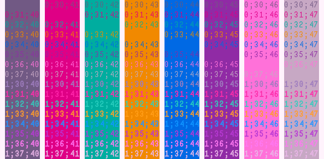

# Moon Queen

<div align="center">
<p>theme pair pulled from <a href="https://github.com/morgansleeper/SailorMoonR">morgansleeper/SailorMoonR</a></p>

<br>


</div>

## Palette

|                  | 🌕 moon queen full                                                        | 🌑 moon queen new                                                         |
| ---------------- | ------------------------------------------------------------------------- | ------------------------------------------------------------------------- |
| bg-primary       |  `#fff1fb` |  `#1b1b2c` |
| bg-secondary     |  `#ffe3f8` |  `#11111c` |
| bg-tertiary      |  `#ffcaf2` |  `#38385b` |
| bg-accent        |  `#edc7ee` |  `#3e2e4c` |
| cursor           |  `#b43797` |  `#9697ea` |
| foreground       |  `#5a3a57` |  `#d2c9da` |
| selection-bg     |  `#f2b8da` |  `#b175ac` |
| selection-fg     |  `#916ea9` |  `#fef6eb` |
| black            |  `#674e78` |  `#25253c` |
| red              |  `#d90e7a` |  `#ff0083` |
| green            |  `#00a294` |  `#009f85` |
| yellow           |  `#ec8300` |  `#ff9500` |
| blue             |  `#0059dc` |  `#00a6e2` |
| magenta          |  `#862699` |  `#8865ca` |
| cyan             |  `#ff69d3` |  `#ff84fc` |
| white            |  `#c09ebc` |  `#b7aedd` |
| bright-black     |  `#9570b4` |  `#63729b` |
| bright-red       |  `#fd30a0` |  `#ff57b5` |
| bright-green     |  `#30c3b4` |  `#57cdb4` |
| bright-yellow    |  `#ff9730` |  `#ffb857` |
| bright-blue      |  `#3085ff` |  `#57d1ff` |
| bright-magenta   |  `#b130cb` |  `#b79dfa` |
| bright-cyan      |  `#ff6eef` |  `#ffa6ff` |
| bright-white     |  `#e7ace3` |  `#d3cdff` |

## Installation

Save your desired `.toml` to `~/.config/wezterm/colors` as recommended in [the
docmentation](https://wezfurlong.org/wezterm/config/appearance.html#defining-a-color-scheme-in-a-separate-file).
You can configure it as simply as

```lua
config {
    color_scheme: "Moon Queen Full",
}
```
or something fancier, like timed switching. Mine looks Like:

```lua
local function get_theme()
    local _time = os.date("*t")
    if _time.hour >= 7 and _time.hour < 19 then
        return "Moon Queen Full"
    end
    return "Moon Queen New"
end
```
