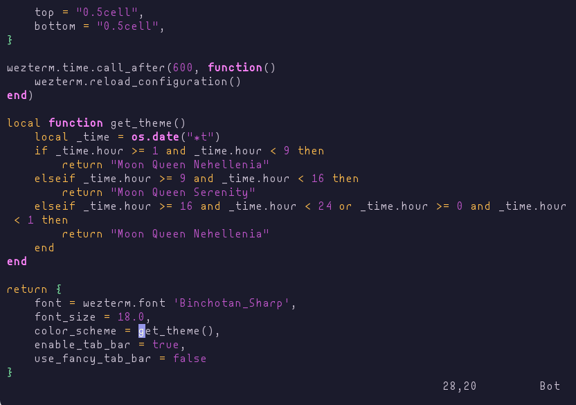

# 🌙 Moon Queen

<div align="center">
<p>theme pair pulled from <a href="https://github.com/morgansleeper/SailorMoonR">morgansleeper/SailorMoonR</a></p>


</div>

* [Palette](#Palette)
* [Installation](#Installation)
    * [Firefox](#Firefox)
    * [Obsidian Borders](#Obsidian)
    * Terminal
        * [iSH](#iSH)
        * [WezTerm](#WezTerm)
* [Screenshots](#Screenshots)

## 🎀 Palette

|              | serenity  | nehellenia |
| ------------ | --------- | ---------- |
| black        | `#4d3a5a` | `#25253c`  |
| red          | `#ff0083` | `#d90e7a`  |
| green        | `#00a294` | `#378a6f`  |
| yellow       | `#ec8300` | `#ffbc4d`  |
| blue         | `#0c1eb8` | `#67a8e4`  |
| magenta      | `#78008b` | `#bf56ca`  |
| cyan         | `#ff69d3` | `#ff84fc`  |
| white        | `#bba6b9` | `#8c8399`  |
| bg-primary   | `#ffe3f8` | `#1b1b2c`  |
| bg-secondary | `#ffcaf2` | `#11111c`  |
| bg-tertiary  | `#fff1fb` | `#38385b`  |
| bg-accent    | `#ecb0ff` | `#3e2e4c`  |
| cursor       | `#db92f4` | `#9697ea`  |
| foreground   | `#674e78` | `#fddbff`  |
| selection-bg | `#fdf298` | `#b175ac`  |
| selection-fg | `#916ea9` | `#fef6eb`  |

## 🐈‍⬛ Installation

### Firefox

 1. Install [Firefox Color](https://addons.mozilla.org/en-US/firefox/addon/firefox-color/).
 2. Click on one of these:
    - [Serenity](https://color.firefox.com/?theme=XQAAAAIoAQAAAAAAAABBqYhm849SCia2CaaEGccwS-xMDPsqvXkIar6hepO9VKy8UGKWymLn_KNg1e23xPY2Vplxl4lPYtGrMFB_CbkSuRVHFktBP0_HJk0uKdhRWBMyQAXmMP_-woUw4fyyDU5YZxsgTkQXXGK0B-zCSQ6s05kp0onUv3bbkrE8uwmf6CVCemaENQQHZ7KrljijnyEc2Yw9GXEVtK6KqmJqsFVHjTXtRYYauG1VXj4jcGEakx_MfHbgXml__zbubAA)
    - [Nehellenia](https://color.firefox.com/?theme=XQAAAAInAQAAAAAAAABBqYhm849SCia2CaaEGccwS-xMDPr9Z-qwEt0Y78fEBV0s5T5VYT16hsxEvJlrkUJlz3WCw-bt9KK1thplGnd6OgiAko6INdKPBC-tDHKEbgGJ_aEUeeMwLx4Zxro8F_zmYJ0pf-QG6e10swEkZvOKzs-DjenLH8uw4FbJQvhthRE9lse51iDtQR4EkwlGXw03-fk4QHeRutrrDDgJjimILK_S25kyY4HgKs_ohq2BAKchSs1jkVxrgrtgQm__9Wb4YA)

### Obsidian
 1. Install and enable [Borders](https://github.com/Akifyss/obsidian-border)
    and [Style Settings](https://github.com/mgmeyers/obsidian-style-settings).
 2. In Style Settings, import these .json files as follows:
    - `serenity.json` &rarr; **Appearance (light mode)**
    - `nehellenia.json` &rarr; **Appearance (dark mode)**
    - `editor.json` &rarr; **Editor**

### Terminal

#### iSH

Save your chosen .json file to your iOS device. I find the iSH directory
finnicky on the default Files app, so I just grab it from my Working Copy
folder.

#### WezTerm

Save your desired `.toml` to `~/.config/wezterm/colors` as recommended in [the
docmentation](https://wezfurlong.org/wezterm/config/appearance.html#defining-a-color-scheme-in-a-separate-file).
You can configure it as simply as

```lua
config {
    color_scheme: "Moon Queen Serenity",
}
```
or something fancier, like timed switching. I scavenged [abzcoding](https://github.com/abzcoding/wezterm/blob/main/wezterm.lua)'s
function for [my config](https://codeberg.org/sailorfe/dotfiles/raw/commit/8dc47502196d173b4d0df908c59a43258359ba64/wezterm.lua):

```lua
local function get_theme()
    local _time = os.date("*t")
    if _time.hour >= 1 and _time.hour < 9 then
        return "Moon Queen Nehellenia"
    elseif _time.hour >= 9 and _time.hour < 17 then
        return "Moon Queen Serenity"
    elseif _time.hour >= 17 and _time.hour < 24 or _time.hour >= 0 and _time.hour < 1 then
        return "Moon Queen Nehellenia"
    end
end
```

## 🥮 Screenshots

<div align="center">
 <br>

</div>