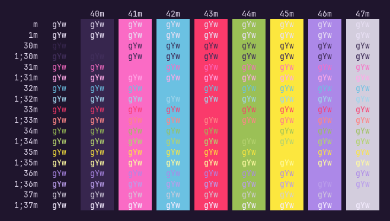

# Moon Queen

<div align="center">
<p>terminal themes from Naoko Takeuchi's <a href="https://missdream.org/raw-sailor-moon-downloads/manga/art-books/"><em>Bishoujo Senshi Sailor Moon</em></a> artbooks</p>




</div>

## Installation

Save your desired `.toml` to `~/.config/wezterm/colors` as recommended in [the
docmentation](https://wezfurlong.org/wezterm/config/appearance.html#defining-a-color-scheme-in-a-separate-file).
You can configure it as simply as

```lua
config {
    color_scheme: "Cosmos",
}
```
or something fancier, like timed switching. Mine looks Like:

```lua
local function get_theme()
    local _time = os.date("*t")
    if _time.hour >= 6 and _time.hour < 10 then
        return "Cosmos"
    elseif _time.hour >= 10 and _time.hour < 16 then
        return "Yume"
    elseif _time.hour >= 16 and _time.hour < 10 then
        return "Cosmos"
    end
    return "Mugen"
end

return {
    color_scheme = get_theme(),
}
```
