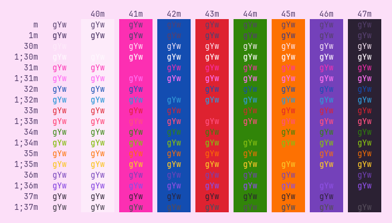
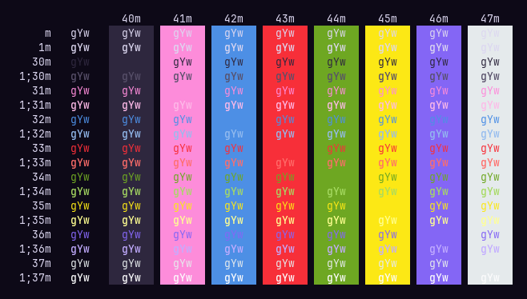

# Moon Queen

<div align="center">
<p>theme pair pulled from <a href="https://missdream.org/raw-sailor-moon-downloads/manga/art-books/"><em>Sailor Moon</em> artbook posters</a> by Naoko Takeuchi</p>


<br>

</div>

## Installation

Save your desired `.toml` to `~/.config/wezterm/colors` as recommended in [the
docmentation](https://wezfurlong.org/wezterm/config/appearance.html#defining-a-color-scheme-in-a-separate-file).
You can configure it as simply as

```lua
config {
    color_scheme: "Yume",
}
```
or something fancier, like timed switching. Mine looks Like:

```lua
local function get_theme()
    local _time = os.date("*t")
    if _time.hour >= 8 and _time.hour < 18 then
        return "Yume"
    end
    return "Mugen"
end
```
